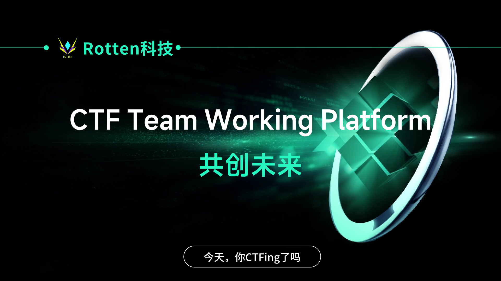

#  CTFPlatForm
(当前文档为英文版本,汉化版本请查看README.MD)

CTFPlatForm is a specialized workspace designed for CTF (Capture The Flag) competition teams, aimed at helping team members collaborate effectively, communicate, and enhance their competition skills. This platform includes the following features:

- **Challenge Management**: Team members can view, discuss, and solve various types of challenges typically found in CTF competitions, including cryptography, reverse engineering, web security, and more.
- **Team Collaboration**: Members can share solution approaches, tool usage experiences, engage in discussions, and collaborate to improve the overall efficiency of the team.
- **Resource Sharing**: The platform usually provides CTF-related learning resources, tool recommendations, challenge analysis, etc., to help team members enhance their skills.
- **Real-time Communication**: Supports real-time chat functionality, facilitating communication and discussions among team members.
- **Event Reminders**: Provides reminders of CTF competition schedules, registration deadlines, and other important event information to help team members participate in competitions promptly.

In summary, the CTF Team Working Platform aims to provide a centralized and efficient working environment to assist team members in collectively improving their skills and achieving better competition results.

# Demo Environment
The core function has not been fully developed and is still pending ...

# Deployment Document
The core function has not been fully developed and is still pending ...

# Technology stack
## Front-end
Vite + VUE3 + TypeScript + Pinia + iN18 + ElementUI Plus
## Backend
.NET 8 + .NET CORE WEB API + SqlSugar + Mysql + JWT
# Development Documentation
Currently, the development documents are stored on Guque

https://www.yuque.com/g/yuwoxinan-6dve9/btr2xe/collaborator/join?token=IgH19kSjaYdevBam&source=book_collaborator# 《CTF团队协作平台》